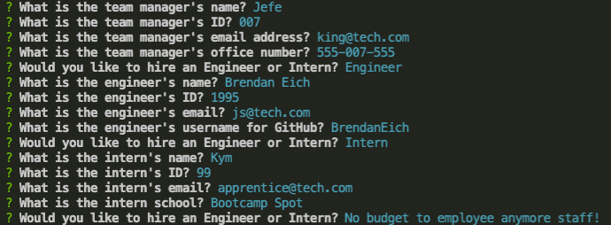
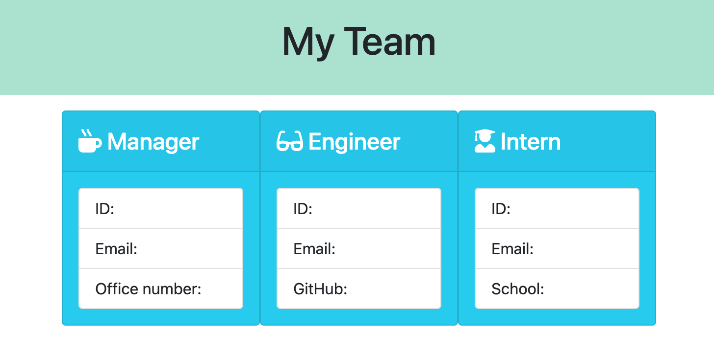
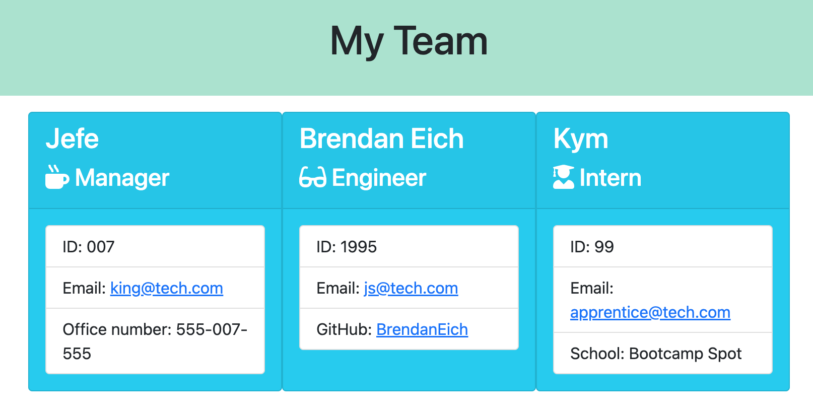

---

# Team Profile Generator

## Description

A command line application designed as a team-generator. Once run, the information returned from the prompts is used to generate an HTML page. The team can run indefinitely until the user decides the team has enough staff.

---

## Table of Contents

[Installation](https://github.com/FryGit87/Company_Profile_Creator#installation)

[Usage](https://github.com/FryGit87/Company_Profile_Creator#usage)

[Contributing](https://github.com/FryGit87/Company_Profile_Creator#contributors)

[Tests](https://github.com/FryGit87/Company_Profile_Creator#tests)

[License](https://github.com/FryGit87/Company_Profile_Creator#license)

[Questions](https://github.com/FryGit87/Company_Profile_Creator#questions)

---

## Installation

To install follow the following instructions:

Clone the repository to your desired location.

Use :

```
git clone git@github.com:FryGit87/Company_Profile_Creator.git
```

Install required dependencies

```
npm install
```

Once installed, Run the application

```
node index.js
```

---

## Usage

Please see instructional video below:








---

## Contributors

The following users contributed to this project:

Any interest in contributing, Fork the repository and create a new 'self-named' branch. Use commit messages to give significant detail on work being pushed. Follow this up with a pull request to the main branch explaining what and why it is to be added.

---

## Tests

There are already tests implemented with in 'test' directory. To run these simpy use the command:

```
npm run test
```

---

## License

This project is covered under the mit license.

To read more about it, [click here](https://choosealicense.com/licenses/mit).

---

## Questions

For any questions regarding the project, contact can be made through the following links.

Github: [FryGit87](https://github.com/FryGit87)

Email: [Email Me](kymreilly.87@hotmail.com)
